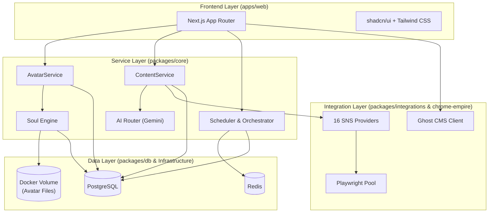

# Avatar CMD — 統合分析レポート & 開発計画書

> **作成日**: 2026-09-08  
> **対象プロジェクト**:  
> 1. [avatar-cmd](file:///C:/Users/retim/Desktop/OpenClaw/01_開発/avatar-cmd) （モノレポ v3 / スケーラブル基盤）  
> 2. [Avater CMD](file:///C:/Users/retim/Desktop/OpenClaw/01_開発/Avater%20CMD) （Next.js 単体 v2 / 実動プロトタイプ）

---

## 目次

1. [プロジェクト全体概要](#1-プロジェクト全体概要)
2. [技術要件](#2-技術要件)
3. [仕様書（システム仕様）](#3-仕様書システム仕様)
4. [各ページ UI 構成とルーティング統合](#4-各ページ-ui-構成とルーティング統合)
5. [機能概要](#5-機能概要)
6. [セキュリティ対策](#6-セキュリティ対策)
7. [環境とインフラ設計](#7-環境とインフラ設計)
8. [ユースケース](#8-ユースケース)
9. [統合開発計画（ロードマップ）](#9-統合開発計画ロードマップ)

---

## 1. プロジェクト全体概要

**Avatar CMD** は、OpenClaw エコシステムにおける**自律型AIアバター統合管理プラットフォーム**です。複数体のAIペルソナ（アバター）が自律的にSNS運用・コンテンツ生成・ナレッジ収集・収益化を行い、人間は「ディレクター（司令塔）」として全体を監督・最適化するコンセプトで設計されています。

### 2つのプロジェクトの位置づけと統合方針

| 項目 | Avater CMD (v2) | avatar-cmd (v3) | 統合後の姿 (Target State) |
|---|---|---|---|
| **構造** | Next.js 単体アプリ | Turborepo + pnpm モノレポ | **v3のモノレポ構造を踏襲** |
| **DB** | SQLite (Prisma) | PostgreSQL 16 (Prisma) | **PostgreSQL** (v2のスキーマをマージ) |
| **AI統合** | Gemini 2.5 Flash 直接統合済み | LLM非依存の決定論的サービス層 | **AI Router層として移植** |
| **SNS運用** | API直接呼び出し | 16プラットフォーム対応デュアルモード | **v3のProvider機構を利用** |
| **ブラウザ自動化**| なし | Playwright プール | **Chrome Empire統合** |
| **Soul Engine** | ファイルベース (`soul.md`) | JSON フィールドベース | **ハイブリッド（ファイル管理＋DB同期）** |
| **バックグラウンド**| Instrumentation + 独自 Cron | SchedulerService | **SchedulerService（Cron＋ジョブキュー）** |

> [!IMPORTANT]
> **統合の基本方針**: v3の「スケーラブルなモノレポ・コンテナアーキテクチャ」をベースとし、そこにv2で実装済みの「AI生成ロジック(Gemini)」「ファイルベースSoul Engine」「Ghost CMS連携」「完成済みUIコンポーネント」を移植します。

---

## 2. 技術要件

### 共通技術スタック (Target Stack)
- **言語/ランタイム**: TypeScript 5.7.3, Node.js 20 (Alpine)
- **モノレポ管理**: Turborepo + pnpm Workspaces
- **フロントエンド**: Next.js 15+ (App Router), React 19, Tailwind CSS 3.4.17, shadcn/ui
- **データベース**: PostgreSQL 16, Prisma ORM
- **キャッシュ/キュー**: Redis 7
- **AI/LLM**: `@google/genai` (Gemini 2.5 Flash)
- **自動化/インフラ**: Playwright (Chromium), Docker, Cloudflare Tunnel
  （当初は Traefik + Let's Encrypt を想定していたが、公開経路を Cloudflare Tunnel に変更。詳細は `avatar-cmd_v3/docs/DEPLOY.md`）

---

## 3. 仕様書（システム仕様）

### 3.1 データモデル統合仕様 (Prisma)

v3のモデルをベースに、v2のエンティティを追加・拡張した **20モデル構成** とします。

> [!TIP] **設計改善ポイント**
> v2の `KnowledgeItem`, `Collaboration`, `Automation` をv3に統合。アバターモデルには、ファイルベースのSoul Engineと整合性を取るため、`lastSyncAt` (ファイルとの最終同期日時) などのメタデータを追加します。

### 3.2 Soul Engine のアーキテクチャ設計

v2のファイルベース（Markdown）の直感的な編集体験と、v3のコンテナベースの運用を両立させます。

> [!WARNING] **コンテナ化におけるファイル永続化の課題解決**
> `data/avatars/` ディレクトリはコンテナの再起動で揮発しないよう、`docker-compose.yml` にて**名前付きボリューム（例: `avatar-data`）**としてマウントする設計に変更します。
> また、ファイルエディタAPI（`GET/PUT /api/avatars/[id]/files`）は、コンテナ内のマウントパスを読み書きするように調整します。

---

## 4. 各ページ UI 構成とルーティング統合

v2とv3のフロントエンドを統合する際、**ルーティングの競合**を解決します。

### 解決策：パスの再配置
v3は `/` がダッシュボードでしたが、v2は `/` がマーケティングLPです。統合後は以下のように整理します。

| 領域 | ルートパス | サブパスの例 | 備考 |
|---|---|---|---|
| **マーケティング** | `/` | `/blog`, `/blog/[slug]`, `/pricing` | v2から移植。公開アクセス可能。 |
| **ダッシュボード** | `/dashboard` | `/dashboard/avatars`, `/dashboard/sns` | v3の画面をベースに、v2の追加画面を統合。要認証。 |
| **API** | `/api` | `/api/avatars`, `/api/queue` | 統合API。 |

### ダッシュボード画面一覧
1. **メイン** (`/dashboard`): 統計、チャート、CollabNetwork
2. **アバター管理** (`/dashboard/avatars`): 一覧、Soul Engineエディタ (v2から移植)
3. **アクティビティ** (`/dashboard/activity`): タイムライン、AI生成ログ
4. **SNS運用** (`/dashboard/sns`): プラットフォーム、投稿ステータス
5. **収益分析** (`/dashboard/revenue`): 月次推移、ランキング
6. **コラボ連携** (`/dashboard/collab`): v2から移植
7. **知識ベース** (`/dashboard/knowledge`): v2から移植。URLスクレイピング機能付き
8. **自動化** (`/dashboard/automation`): ルール管理
9. **設定** (`/dashboard/settings`): セキュリティ、API設定
10. **Chrome Empire** (`/dashboard/chrome`): v3独自のプール監視

---

## 5. 機能概要

（統合により、v2/v3の機能を網羅したフルスタック機能を提供します）

- **アバター人格定義**: ファイルベースの Markdown (`soul.md`) を Gemini 2.5 Flash にコンテキスト注入
- **自律的コンテンツ生成**: スケジューラ起動による自動トピック選定・記事生成
- **16プラットフォーム対応**: APIとブラウザ操作のハイブリッド投稿
- **ブラウザ自動化**: Playwright プールによるBAN回避・セッション永続化運用
- **収益・分析トラッキング**: 複数チャネルからの収益とエンゲージメント集計

---

## 6. セキュリティ対策

統合システムにおいてクリティカルなセキュリティ要件：

1. **暗号化**: 外部APIトークン・パスワードは `AES-256-GCM` で暗号化しDB保存（v3実装済み）
2. **SSRF防御**: ナレッジスクレイピング（v2由来）機能において、ローカルIP（`127.0.0.1`, `169.254.x.x` 等）へのフェッチをブロックするバリデーションを追加
3. **ファイルパストラバーサル防御**: Soul Engine API で `..` や絶対パスによる不正ファイルアクセスを厳密に遮断
4. **認証・認可**: `NextAuth v5` (または Auth.js) を導入し、ダッシュボードへのアクセスを保護（ロール: OWNER/ADMIN等）

---

## 7. 環境とインフラ設計

**Docker Compose による4+1コンテナ構成**:
1. `web` (Next.js) - 1.0 CPU / 512MB RAM
2. `db` (PostgreSQL 16) - 0.5 CPU / 512MB RAM
3. `redis` (Redis 7) - 0.2 CPU / 192MB RAM
4. `chrome-empire` (Playwright) - 3.0 CPU / 3GB RAM

> [!TIP] **データ移行（SQLite → PostgreSQL）**
> V2の `dev.db` からのデータ移行は、今回は不要と判断（プロトタイプデータのため）。
> 代わりに、Prisma のシードスクリプト（`seed.ts`）を拡張し、統合システム起動時に初期アバター5体と各種ダッシュボード用ダミーデータが自動生成されるようにします。

---

## 8. ユースケース

- **UC1: アバター設定と人格の調整**: 管理者がダッシュボードから `soul.md` を編集し、直ちにAIの生成口調に反映。
- **UC2: ナレッジの自動収集**: 任意のURLを投入すると、バックグラウンドワーカーが記事をスクレイピングし、アバターの知識データベースに蓄積。
- **UC3: 完全自律型のSNS運用**: 定期ジョブがアバターの感情・知識・スケジュールに基づき、Xやnote等へ自動投稿を実行。

---

## 9. 統合開発計画（ロードマップ）

段階的かつ確実な統合を実現するための4フェーズ計画。

### Phase 1: モノレポ基盤の確立とバックエンド統合 (1.5週間)
- v3 (`avatar-cmd`) リポジトリをベースとして初期化。
- Prismaスキーマの統合（PostgreSQL向けに最適化、マイグレーション実行）。
- v2の `lib/ai/router.ts` (Gemini連携)、`lib/avatar-fs/*` (Soul Engine) を `packages/core` に移植。
- **テスト・検証**: `packages/core` の単体テスト実行、DB CRUD確認。

### Phase 2: フロントエンド統合とルーティング整理 (2週間)
- ルーティングの再配置（`/dashboard` 配下へのv3画面の移動）。
- v2のマーケティングLP・Ghost連携を `apps/web/src/app/(marketing)` に移植。
- v2の追加ダッシュボード画面（コラボ、ナレッジ、Soul Engineエディタ）の移植。
- **テスト・検証**: ローカル環境での画面遷移、UIコンポーネントの表示崩れ確認。

### Phase 3: 自律運用パイプラインの結合 (1.5週間)
- v2の Orchestrator (Job Queue) と v3の SchedulerService の統合。Redisを活用した堅牢なジョブ管理。
- Chrome Empire ワーカープロセスとの結合（Playwright コンテナへの通信）。
- SSRF防御、認証(NextAuth)の組み込み。
- **テスト・検証**: ジョブ投入からAI生成、SNS（モック）投稿までのE2E通しテスト。

### Phase 4: デプロイ準備とインフラ構築 (1週間)
- Docker Compose の設定更新（Soul Engine用ボリュームマウントの追加等）。
- VPS環境（Xserver VPS等）へのステージング・デプロイ。
- ~~Traefik を用いた HTTPS 自動化~~ → Cloudflare Tunnel で公開（TLS 終端と証明書は Cloudflare 側が担当）。VPS の 80/443 は開けない。
- 最終動作確認と `walkthrough.md` の作成。

---

## 次のステップ (Deep Execute / DocSnap への接続)

本計画が承認され次第、`/deep-execute` スキルのワークフローに則り、**Phase 1・2 の主要な統合実装（ディレクトリ移動、スキーマ更新、AIモジュールの移植等）** に着手します。
実装と検証が完了した後、`/docsnap` スキルを適用して、新システムの動作（ダッシュボード等）の画面マニュアル生成フェーズへ移行可能です。
